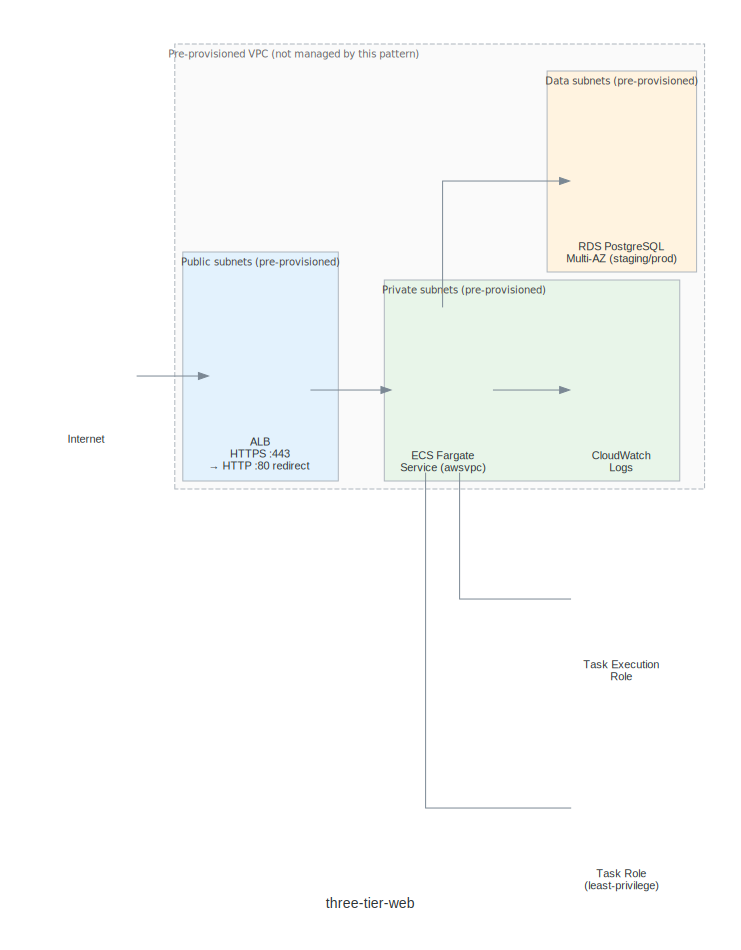

# three-tier-web — Runbook

ALB + ECS Fargate + RDS PostgreSQL on the enterprise pre-provisioned VPC.

## Architecture



## What this pattern provisions

| Resource | Type | Notes |
|---|---|---|
| `sg-alb` | EC2 SecurityGroup | 0.0.0.0/0 on :80/:443 only |
| `sg-app` | EC2 SecurityGroup | Ingress from ALB SG only |
| `sg-data` | EC2 SecurityGroup | Port 5432 from app SG only |
| `ecs-task-execution-role` | IAM Role | AmazonECSTaskExecutionRolePolicy |
| `ecs-task-role` | IAM Role | Least-privilege; extend per app |
| `log-group` | CloudWatch Logs Group | `/ecs/<appName>-<env>` |
| `db-subnet-group` | RDS SubnetGroup | Data-tier subnets via selector |
| `rds-instance` | RDS PostgreSQL 15.4 | Multi-AZ for staging/prod |
| `ecs-cluster` | ECS Cluster | ContainerInsights enabled |
| `ecs-task-definition` | ECS TaskDefinition | Fargate, awsvpc |
| `ecs-service` | ECS Service | Private subnets, ALB-integrated |
| `alb` | Application Load Balancer | Public subnets |
| `alb-target-group` | ALB Target Group | IP mode, health check configured |
| `alb-listener-http` | ALB Listener :80 | Redirects to HTTPS |
| `alb-listener-https` | ALB Listener :443 | Forwards to target group |

## Not provisioned (pre-existing enterprise infrastructure)

VPC, subnets, NAT gateways, and internet gateways are **not provisioned** by
this pattern. Resources select into the enterprise network using label selectors:

```yaml
subnetIdSelector:
  matchLabels:
    tier: public      # or private / data
    environment: dev  # patched from spec.parameters.environment
```

## Outputs (connection secret)

After the claim syncs (~10-15 minutes for RDS):

| Key | Description |
|---|---|
| `albDnsName` | ALB public DNS — use as the application endpoint |
| `rdsEndpoint` | RDS hostname |
| `rdsPort` | RDS port (5432) |
| `ecsClusterArn` | ECS Cluster ARN |
| `ecsServiceArn` | ECS Service ARN |
| `taskRoleArn` | Task IAM role ARN |
| `logGroupArn` | CloudWatch log group ARN |

## Well-Architected compliance

See [well-architected-review.md](well-architected-review.md) for the full
per-practice scorecard. All high-severity practices are Pass as of the initial
review. One medium-severity Partial noted (SEC08-BP01: KMS CMK not enforced;
AWS-managed key used instead — acceptable for beta).
